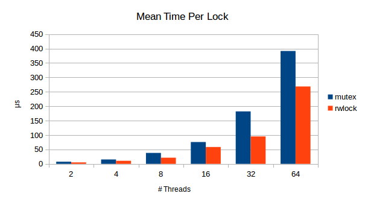
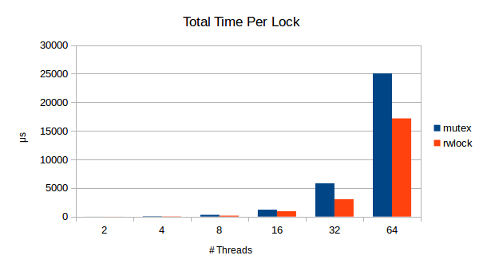

# Analysing lock contention with LTTNG

A common performance problem found in concurrent applications implemented with locks is **contention**. When we face this kind of problems, tracing is a good technique that can help us to understand what is happening during the execution of our applications. In particular, TTNG is a great tracing tool since it allows recording and analysing events at multiple levels, easily providing us with a wide and consistent view of the system.

### A Concurrent LRU Cache

We are going to show a way to analyse contention in a small application: a concurrent LRU Cache using Pthread locks written in C. In this test, multiple threads read and write concurrently a cache that is protected by a Pthread lock. To simulate the normal operation of the cache, each thread randomly performs 80% of the invocations as reads while the other 20% as writes. We will compare the performance of our cache using mutex and read-write-locks expecting an improvement using the last locks.

The procedure is the following. First, we need to instrument our application, which means, writing (tracepoints) to trace the time wasted between lock requests and acquisitions. Second, set-up a LTTNG session and execute our test to record these traces. Finally we collect and analyse these traces to present our results.

Our main goal is to show how simple is to use LTTNG to analyse non trivial performance problems in multi-threaded programming. For sake of explanation, we will present only important parts of our test. However, the complete source code can be found in the [repository](https://github.com/rmontalvo/lttng-test.git).

#### Custom tracepoints

In order to trace information about how much time each process wastes acquiring a Pthread Mutex, we could write tracepoints as described in the LTTNG's docs. Though, we would need to modify our cache implementation.

Instead, we opt for a less intrusive alternative. We are going to use and extend a Pthread wrapper implementation provided by LTTNG (hard work is already done ;)). This wrapper can be injected just before the start of the execution of our test program, adding our traces to the Pthread lock invocations without touching our cache code. The code below shows the modifications to the tracepoints and to the `pthread_mutex_lock()` function.

```c
/** pthread_wrapper/lttng-ust-pthread.c **/
int pthread_mutex_lock(pthread_mutex_t *mutex)
{
	// ...
	// Requesting lock, we take start time
	clock_gettime(CLOCK_MONOTONIC, &start);
	retval = mutex_lock(mutex);
	// Lock acquired, we take end time
	clock_gettime(CLOCK_MONOTONIC, &end);
	unsigned long int elapsed_time = ELAPSED_TIME(start, end);
	// We trace the spent time
	tracepoint(ust_pthread, pthread_mutex_lock_acq, mutex, retval, elapsed_time);
	// ...
}
```

```c
/** pthread_wrapper/ust_pthread.h **/
TRACEPOINT_EVENT(ust_pthread, pthread_mutex_lock_acq,
	TP_ARGS(pthread_mutex_t *, mutex, int, status, unsigned long int, elapsed_time),
	TP_FIELDS(
		ctf_integer_hex(void *, mutex, mutex)
		ctf_integer(int, status, status)
		ctf_integer(unsigned long int, elapsed_time, elapsed_time)
	)
)
```

As mentioned above, our intuition points that replacing the mutex with a read-write-lock could improve the performance of our cache. In the original LTTNG wrapper for lock functions, there is no base implementation for read-write-locks, nevertheless, is very easy to write them following the skeleton of the others already provided.

```c
/** pthread_wrapper/lttng-ust-pthread.c **/
int pthread_rwlock_rdlock(pthread_rwlock_t *rwlock)
{
	static int (*rwlock_rdlock)(pthread_rwlock_t *);
	struct timespec start, end;
	int retval;

	if (!rwlock_rdlock) {
		rwlock_rdlock = dlsym(RTLD_NEXT, "pthread_rwlock_rdlock");
		if (!rwlock_rdlock) {
			if (thread_in_trace) {
				abort();
			}
			fprintf(stderr, "unable to initialize pthread wrapper library.\n");
			return EINVAL;
		}
	}
	if (thread_in_trace) {
		return rwlock_rdlock(rwlock);
	}

	thread_in_trace = 1;
	tracepoint(ust_pthread, pthread_rwlock_rdlock_req, rwlock);
	clock_gettime(CLOCK_MONOTONIC, &start);
	retval = rwlock_rdlock(rwlock);
	clock_gettime(CLOCK_MONOTONIC, &end);
	unsigned long int elapsed_time = ELAPSED_TIME(start, end);
	tracepoint(ust_pthread, pthread_rwlock_rdlock_acq, rwlock, retval, elapsed_time);
	thread_in_trace = 0;
	return retval;
}
```

There are other tracepoints added to the test, but they are straightforward to understand and we will omit them.

#### Session configuration
To record these tracepoints we need to enable them during the execution of a session as it is shown below.

```shell
# makefile
	lttng create test_locks
	lttng enable-event -u ust_pthread:pthread_mutex_lock_req,ust_pthread:pthread_mutex_lock_acq
	lttng enable-event -u ust_pthread:pthread_rwlock_rdlock_acq,ust_pthread:pthread_rwlock_wrlock_acq
	lttng enable-event -u tl:start_test,tl:end_test,tl:start_test_thread,tl:end_test_thread
	lttng add-context -u -c channel0 -t procname -t vpid -t vtid
	lttng start
	LD_PRELOAD=./pthread_wrapper/liblttng-ust-pthread-wrapper.so ./test_locks
	lttng stop
	lttng destroy
```

#### Collecting results
Now we are ready to collect results. To do this, we only need to write a small python script (`stats.py`) that sums up times. This is easy taking advantage of Babeltrace. The following charts show our results.






### About LTTNG

Though our example is simple, it shows perfectly the possibilities of the LTTNG framework as a tool to analyse performance problems. For example, we can use it to analyse more complex problems in multi-threaded programming like False Sharing. We can take advantage of its integration with Perf's events to record and analyse cache misses.
